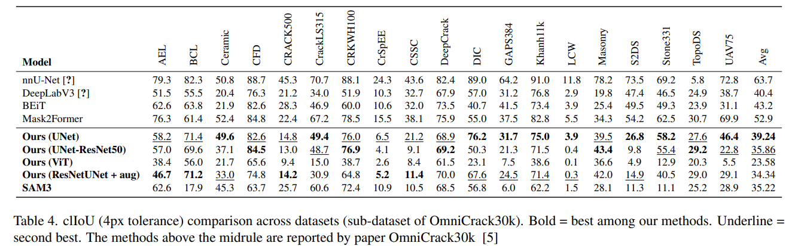
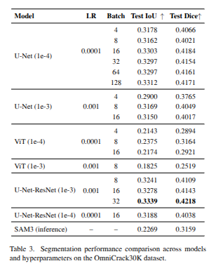
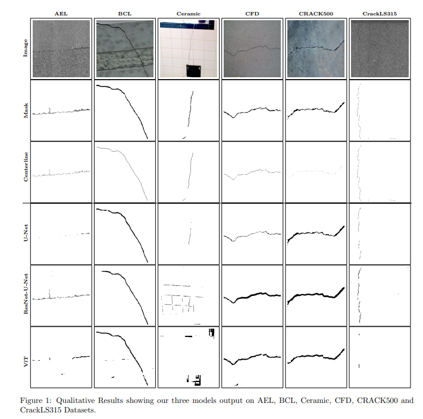

# CrackLengthProject

## Install requirements
```
pip install requirements.txt
```

## Prepare data
### OmniCrack30k
Request access and download OmniCrack30k(https://github.com/ben-z-original/omnicrack30k)

Unzip and put under dataset as dataset/omnicrack30k
### Crack Length dataset
Download crack length dataset from Kaggle(https://www.kaggle.com/datasets/maksimlitvinov39/crack-final-data)


## Crack segmentation

### Training
Run with proper model name

```
python crack_seg.py --model MODEL_NAME
```

### Inference
```
python inference.py --model MODEL_NAME --model_path MODEL_PATH
```

### Evaluation
```
python evaluation.py --model MODEL_NAME --checkpoints CHECKPOINTS
```
## Crack length
### Training and Evaluation
```
python train_eval_crack_len.py --model MODEL_NAME --checkpoints CHECKPOINTS
```

## Quantitative results





## Qualitative results
